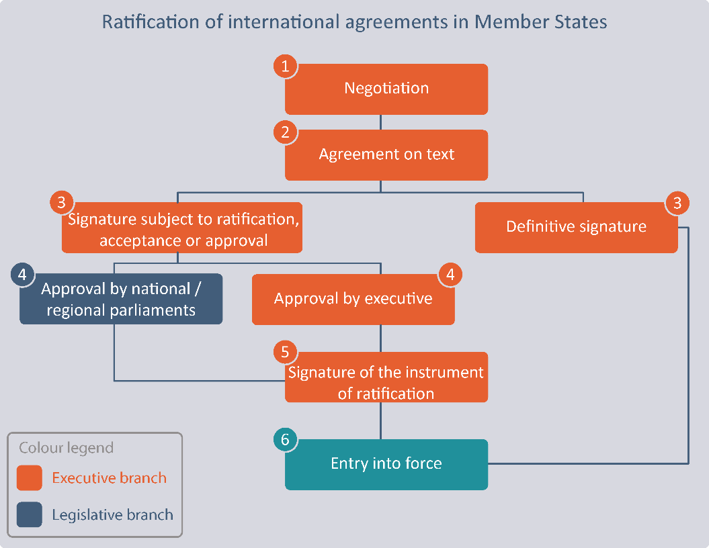

# Visualizing UN Treaties

[The United Nations Treaty collection](https://treaties.un.org/Pages/ParticipationStatus.aspx?clang=_en) organizes UN treaties per "Chapters" (e.g. `Human Rights`, `Traffic in Persons`, `Law of the Sea`, ...)

Each chapter holds a list of treaties and the page about each treaty would say which country has signed/ratified, applied or accessed it, and when if they ever did.

* [Definitions](#definitions)
   * [Prepraration of a treaty](#prepraration-of-a-treaty)
      * [Adoption](#adoption)
      * [Authentication](#authentication)
      * [Signature](#signature)
   * [Consent of a state to be bound by a treaty](#consent-of-a-state-to-be-bound-by-a-treaty)
      * [Ratification or Accession](#ratification-or-accession)
      * [Acceptance and Approval](#acceptance-and-approval)
      * [Act of Formal Confirmation](#act-of-formal-confirmation)
      * [Entry into Force](#entry-into-force)
      * [Amendment](#amendment)
   * [Becoming a Party](#becoming-a-party)
   * [Optional Protocols](#optional-protocols)
* [References](#references)

## Definitions

UN Treaties are legal documents and as such slightly cryptic for the common mortals.

International human rights treaties are developed by a process of negotiation among United Nations Member States to produce a commonly acceptable set of standards. Individual States then decide for themselves whether to be legally bound by the treaty. There are two ways for a State to become a party to the Convention on the Rights of the Child:

* by [signature](#signature) and [ratification](#ratification-or-accession)
* or by [accession](#ratification-or-accession).

> Both of these acts signify an agreement to be legally bound by the terms of the Convention.

The [Optional Protocols](#optional-protocols) to the Convention are considered independently of the Convention and must be ratified or acceded to separately, but the process is the same.  States do not need to be a party to the Convention in order to ratify or accede to one or both of the Optional Protocols.

To help ourselves first, here are further definitions:

### Prepraration of a treaty

#### Adoption

"Adoption" is the formal act by which the form and content of a proposed treaty text are established. As a general rule, the adoption of the text of a treaty takes place through the expression of the consent of the states participating in the treaty-making process. Treaties that are negotiated within an international organization will usually be adopted by a resolution of a representative organ of the organization whose membership more or less corresponds to the potential participation in the treaty in question. A treaty can also be adopted by an international conference which has specifically been convened for setting up the treaty, by a vote of two thirds of the states present and voting, unless, by the same majority, they have decided to apply a different rule.

#### Authentication

The term "authentication" refers to the procedure whereby the text of a treaty is established as authentic and definitive. Once a treaty has been authenticated, states cannot unilaterally change its provisions. If states which negotiated a given treaty do not agree on specific procedures for authentication, a treaty will usually be authenticated by signature, signature ad referendum or the initialling by the representatives of those states.

#### Signature

Signature constitutes a preliminary endorsement of the Convention or Protocol. **Signing the instrument does not create a binding legal obligation** but does demonstrate the State’s intent to examine the treaty domestically and consider ratifying it.

While signing does not commit a State to ratification, it does oblige the State to refrain from acts that would defeat or undermine the treaty’s objective and purpose.

### Consent of a state to be bound by a treaty

#### Ratification or Accession

Ratification or accession signifies an agreement to be **legally bound by the terms of the Convention**.

Though accession has the same legal effect as ratification, the procedures differ:

* In the case of ratification, the State first signs and then ratifies the treaty.
* The procedure for accession has only one step, it is not preceded by an act of signature.

The formal procedures for ratification or accession vary according to the national legislative requirements of the State. Prior to ratification or accession, a country normally reviews the treaty to determine whether national laws are consistent with its provisions and to consider the most appropriate means of promoting compliance with the treaty.

Most commonly, countries that are promoting the Convention sign shortly after it has been adopted. They then ratify the treaty when all of their domestically required legal procedures have been fulfilled. Other States may begin with the domestic approval process and accede to the treaty once their domestic procedures have been completed, without signing the treaty first.

Both ratification and accession involve two steps. First, the appropriate national organ of the country—Parliament, Senate, the Crown, Head of State or Government, or a combination of these—follows domestic constitutional procedures and makes a formal decision to be a party to the treaty. Second, the instrument of ratification or accession, a formal sealed letter referring to the decision and signed by the State’s responsible authority, is prepared and deposited with the United Nations Secretary-General in New York.

#### Acceptance and Approval

The instruments of "acceptance" or "approval" of a treaty have the same legal effect as ratification and consequently express the consent of a state to be bound by a treaty. In the practice of certain states acceptance and approval have been used instead of ratification when, at a national level, constitutional law does not require the treaty to be ratified by the head of state.

#### Act of Formal Confirmation

"Act of formal confirmation" is used as an equivalent for the term "ratification" when an international organization expresses its consent to be bound to a treaty.

#### Entry into Force

Typically, the provisions of the treaty determine the date on which the treaty enters into force. Where the treaty does not specify a date, there is a presumption that the treaty is intended to come into force as soon as all the negotiating states have consented to be bound by the treaty. Bilateral treaties may provide for their entry into force on a particular date, upon the day of their last signature, upon exchange of the instruments of ratification or upon the exchange of notifications. In cases where multilateral treaties are involved, it is common to provide for a fixed number of states to express their consent for entry into force. Some treaties provide for additional conditions to be satisfied, e.g., by specifying that a certain category of states must be among the consenters. The treaty may also provide for an additional time period to elapse after the required number of countries have expressed their consent or the conditions have been satisfied. A treaty enters into force for those states which gave the required consent. A treaty may also provide that, upon certain conditions having been met, it shall come into force provisionally.

#### Amendment

The term "amendment" refers to the formal alteration of treaty provisions affecting all the parties to the particular agreement. Such alterations must be effected with the same formalities that attended the original formation of the treaty. Many multilateral treaties lay down specific requirements to be satisfied for amendments to be adopted. In the absence of such provisions, amendments require the consent of all the parties.

### Becoming a Party

Various terms are used to indicate that a State or regional economic integration organization (e.g. the European Union (EU)) has consented to be bound by an international treaty, including "ratification", "accession", "approval" and "acceptance". The legal implications of each of these forms of consent are the same to the extent that the treaty becomes legally binding.

All States that have ratified, acceded to, approved or accepted the Protocol are therefore, legally, Parties to the Protocol.

The primary distinction in becoming a Party is usually made between ratification and accession. Only those States that signed the Protocol when it was open for signature can proceed to ratify it. In signing the Protocol, States only indicated general support for its objective and provisions as well as their intention to become Parties in the future and be legally bound by it. However, the act of signing, in itself, did not establish consent to be bound by the Protocol. Therefore, the further act of ratification is required before the State becomes a Party.

The instrument of ratification is signed by the Head of State, Government or Minister for Foreign Affairs and deposited with the Depositary – the Secretary-General of the United Nations. Once a State has deposited this instrument, the Protocol then enters into force for that State ninety days later. At this point, the State is bound by the provisions of the Protocol and must comply with its obligations.

States that did not sign the Protocol during the time when it was open for signature cannot ratify it – they may only __accede to it__. These States therefore deposit an instrument of accession in order to become a Party. (Note: These States have the same rights and obligations as those States that ratified the Protocol.)

### Optional Protocols

__To be added__

## References

* [Glossary of terms relating to Treaty actions](https://treaties.un.org/Pages/Overview.aspx?path=overview/glossary/page1_en.xml)
* [Signature, ratification and accession: The process of creating binding obligations on governments](https://www.unicef.org/crc/index_30207.html) (Unicef)
* [Slides on Finding UN Agreements](http://guides.lib.umich.edu/ld.php?content_id=11412302) (Michigan State University)
* [UN Web TV](http://webtv.un.org/)
* [Specific case on biodiversity, with definitions](https://bch.cbd.int/help/topics/en/webtoc.html)
